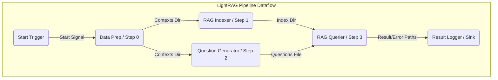

## MoFA Graph RAG Documentation

---

#### 1. Overview

This document describes a data processing pipeline built using the MoFA (Modular Framework for Agent) and DORA-rs framework. The pipeline replicates the functionality of the `lightRAG` example project, breaking down its four main stages (Data Preparation, RAG Indexing, Question Generation, RAG Querying) into distinct DORA operators. An additional logger operator acts as a sink for the final results.

The goal is to demonstrate how to build a modular and dataflow-driven RAG pipeline using MoFA principles within the DORA environment.

#### 2. Dataflow Diagram

This diagram illustrates the flow of data between the operators in the pipeline:



#### 3. Operator Descriptions

##### 3.1. `start-trigger` (Example Initiator)
*   **Purpose:** Initiates the dataflow by sending a single trigger message. This example uses `dora-timer`, but any node sending an initial message would work.
*   **Operator:** `dora-timer` (or custom simple Python node)
*   **Inputs:** None
*   **Outputs:**
    *   `tick`: A simple trigger signal.
*   **Configuration:** See `dora-timer` documentation (or `config:` section in `dataflow.yml` if customized).
*   **Dependencies:** `dora-timer` node (if used).

##### 3.2. `data-prep` (Data Preparation Operator / Step 0)
*   **Purpose:** Downloads the specified dataset (e.g., `TommyChien/UltraDomain`) from Hugging Face Hub, extracts unique `context` fields from JSONL files, and saves them into separate JSON files within an output directory.
*   **Operator Script:** `scripts/data_prep_operator.py`
*   **Inputs:**
    *   `trigger` (from `start-trigger/tick`): Signal to start processing.
*   **Outputs:**
    *   `unique_contexts_dir`: (String) The absolute path to the directory containing the generated unique context JSON files.
*   **Configuration File:** `configs/data_prep_config.yml`
*   **Dependencies:** `huggingface_hub`, `pyarrow`, `dora-rs`, `pyyaml` (or MoFA utils).

##### 3.3. `rag-indexer` (RAG Indexing Operator / Step 1)
*   **Purpose:** Initializes a `LightRAG` instance, reads unique context JSON files from the directory provided by `data-prep`, embeds the contexts, and builds the RAG search index within a specified working directory.
*   **Operator Script:** `scripts/rag_index_operator.py`
*   **Inputs:**
    *   `unique_contexts_dir` (from `data-prep/unique_contexts_dir`): Path to the directory with unique context files.
*   **Outputs:**
    *   `rag_index_dir`: (String) The absolute path to the `LightRAG` working directory containing the initialized index.
*   **Configuration File:** `configs/rag_index_config.yml`
*   **Dependencies:** `lightrag`, `openai` (or other LLM client), `numpy`, `pyarrow`, `dora-rs`, `pyyaml` (or MoFA utils).

##### 3.4. `question-generator` (Question Generation Operator / Step 2)
*   **Purpose:** Reads a specific unique context file (e.g., `mix_unique_contexts.json`), generates summaries, constructs a prompt, calls an LLM to generate user personas, tasks, and high-level questions based on the dataset content, and saves the generated questions to a text file.
*   **Operator Script:** `scripts/question_gen_operator.py`
*   **Inputs:**
    *   `unique_contexts_dir` (from `data-prep/unique_contexts_dir`): Path to the directory with unique context files.
*   **Outputs:**
    *   `generated_questions_file`: (String) The absolute path to the text file containing the LLM-generated questions.
*   **Configuration File:** `configs/question_gen_config.yml`
*   **Dependencies:** `openai` (or other LLM client), `transformers`, `pyarrow`, `dora-rs`, `pyyaml` (or MoFA utils).

##### 3.5. `rag-querier` (RAG Querying Operator / Step 3)
*   **Purpose:** Initializes `LightRAG` using the existing index directory provided by `rag-indexer`. It then extracts questions from the file provided by `question-generator`, queries the RAG system for each question, and saves the results (successful queries) and errors (failed queries) into separate JSON files.
*   **Operator Script:** `scripts/rag_query_operator.py`
*   **Inputs:**
    *   `rag_index_dir` (from `rag-indexer/rag_index_dir`): Path to the RAG working directory.
    *   `generated_questions_file` (from `question-generator/generated_questions_file`): Path to the questions text file.
*   **Outputs:**
    *   `query_results`: (Dict) A dictionary containing the absolute paths to the results JSON file (`results_file`) and the errors JSON file (`errors_file`). Example: `{"results_file": "/path/to/query_results.json", "errors_file": "/path/to/query_errors.json"}`.
*   **Configuration File:** `configs/rag_query_config.yml`
*   **Dependencies:** `lightrag`, `openai` (or other LLM client), `numpy`, `pyarrow`, `dora-rs`, `pyyaml` (or MoFA utils).

##### 3.6. `result-logger` (Result Logging Operator / Sink)
*   **Purpose:** Acts as the final node (sink) in the pipeline. It receives the output paths from `rag-querier`, logs the payload, and optionally verifies if the result/error files exist.
*   **Operator Script:** `scripts/result_logger_operator.py`
*   **Inputs:**
    *   `final_output` (from `rag-querier/query_results`): The dictionary containing paths to the final result and error files.
*   **Outputs:** None.
*   **Configuration File:** None for this specific operator.
*   **Dependencies:** `pyarrow`, `dora-rs`, `pyyaml` (or MoFA utils for `load_node_result`).

#### 4. Configuration Files

Configuration for operators is managed via YAML files located in the `configs/` directory. **Remember to replace placeholder values (like API keys and potentially paths) with your actual settings.**

*   **`configs/data_prep_config.yml`**: Configures the `data-prep` operator.
    *   `DATASET_REPO_ID`: Hugging Face dataset identifier.
    *   `DOWNLOAD_DIR`: Directory to download the raw dataset.
    *   `OUTPUT_DIR`: Directory to save extracted unique context files.
    *   `SKIP_DOWNLOAD`: Boolean flag to skip downloading if data exists.
*   **`configs/rag_index_config.yml`**: Configures the `rag-indexer` operator.
    *   `INPUT_CONTEXTS_FILENAME_PATTERN`: Glob pattern to find context files.
    *   `WORKING_DIR`: Directory for LightRAG storage (index, cache).
    *   `LLM_*`: Settings for the LLM (API key, base URL, model name).
    *   `EMBEDDING_*`: Settings for the embedding model (API key, base URL, model name, dimension, token size, batch number).
    *   `INSERT_*`: Settings for insertion retries.
*   **`configs/question_gen_config.yml`**: Configures the `question-generator` operator.
    *   `INPUT_CONTEXTS_FILENAME`: Specific context filename to process.
    *   `TOKENIZER_MODEL`: Hugging Face tokenizer model name.
    *   `SUMMARY_TOTAL_TOKENS`: Parameter for the summary function.
    *   `LLM_*`: Settings for the LLM used for question generation.
    *   `OUTPUT_QUESTIONS_FILE`: Path to save the generated questions text file.
*   **`configs/rag_query_config.yml`**: Configures the `rag-querier` operator.
    *   `QUERY_MODE`: LightRAG query mode (e.g., `hybrid`).
    *   `QUERY_*`: Settings for query retries.
    *   `LLM_*`, `EMBEDDING_*`: Settings required by LightRAG initialization (must match indexer settings).
    *   `OUTPUT_RESULTS_FILE`: Path to save successful query results.
    *   `OUTPUT_ERRORS_FILE`: Path to save failed query attempts.

#### 5. How to Run

1.  **Install Dependencies:** Ensure all required Python packages listed in the operator dependencies (e.g., `dora-rs`, `lightrag`, `openai`, `transformers`, `huggingface_hub`, `pyarrow`, `numpy`, `pyyaml`) are installed in your environment.
2.  **Configure:** Edit the `.yml` files in the `configs/` directory, providing your API keys, desired model names, and checking/adjusting file paths if necessary.
3.  **Set up DORA:** Make sure the DORA daemon (`dorad`) is running.
4.  **Navigate:** Open your terminal in the project's root directory (where `dataflow.yml` resides).
5.  **Start Dataflow:** Run the command:
    ```bash
    dora start dataflow.yml
    ```
6.  **Monitor:** Observe the logs from `dorad` and potentially the `result-logger` operator's output to track progress and see the final results. You can also use `dora list` and `dora logs <node_id>` for more details.

