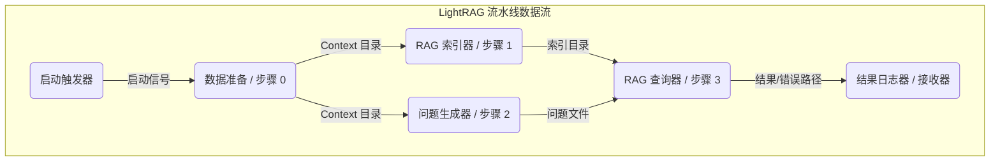

#### 1. 概述


其目标是演示如何在 DORA 环境中使用 MoFA 原则构建模块化、数据流驱动的 RAG 流水线。

#### 2. 数据流图

该图展示了流水线中算子之间的数据流动：



#### 3. 算子描述

##### 3.1. `start-trigger` (示例启动器)
*   **目的:** 通过发送单个触发消息来启动数据流。此示例使用 `dora-timer`，但任何发送初始消息的节点都可以工作。
*   **算子:** `dora-timer` (或自定义的简单 Python 节点)
*   **输入:** 无
*   **输出:**
    *   `tick`: 一个简单的触发信号。
*   **配置:** 参考 `dora-timer` 文档 (如果在 `dataflow.yml` 中自定义，则参考 `config:` 部分)。
*   **依赖:** `dora-timer` 节点 (如果使用)。

##### 3.2. `data-prep` (数据准备算子 / 步骤 0)
*   **目的:** 从 Hugging Face Hub 下载指定的数据集 (例如 `TommyChien/UltraDomain`)，从 JSONL 文件中提取唯一的 `context` 字段，并将它们保存到输出目录中的单独 JSON 文件中。
*   **算子脚本:** `scripts/data_prep_operator.py`
*   **输入:**
    *   `trigger` (来自 `start-trigger/tick`): 开始处理的信号。
*   **输出:**
    *   `unique_contexts_dir`: (字符串) 包含生成的唯一 context JSON 文件的目录的绝对路径。
*   **配置文件:** `configs/data_prep_config.yml`
*   **依赖:** `huggingface_hub`, `pyarrow`, `dora-rs`, `pyyaml` (或 MoFA 工具库)。

##### 3.3. `rag-indexer` (RAG 索引算子 / 步骤 1)
*   **目的:** 初始化 `LightRAG` 实例，从 `data-prep` 提供的目录中读取唯一的 context JSON 文件，嵌入 context，并在指定的工作目录中构建 RAG 搜索索引。
*   **算子脚本:** `scripts/rag_index_operator.py`
*   **输入:**
    *   `unique_contexts_dir` (来自 `data-prep/unique_contexts_dir`): 包含唯一 context 文件的目录路径。
*   **输出:**
    *   `rag_index_dir`: (字符串) 包含初始化索引的 `LightRAG` 工作目录的绝对路径。
*   **配置文件:** `configs/rag_index_config.yml`
*   **依赖:** `lightrag`, `openai` (或其他 LLM 客户端), `numpy`, `pyarrow`, `dora-rs`, `pyyaml` (或 MoFA 工具库)。

##### 3.4. `question-generator` (问题生成算子 / 步骤 2)
*   **目的:** 读取指定的唯一 context 文件 (例如 `mix_unique_contexts.json`)，生成摘要，构建提示，调用 LLM 以生成用户画像、任务以及基于数据集内容的高层次问题，并将生成的问题保存到文本文件中。
*   **算子脚本:** `scripts/question_gen_operator.py`
*   **输入:**
    *   `unique_contexts_dir` (来自 `data-prep/unique_contexts_dir`): 包含唯一 context 文件的目录路径。
*   **输出:**
    *   `generated_questions_file`: (字符串) 包含 LLM 生成的问题的文本文件的绝对路径。
*   **配置文件:** `configs/question_gen_config.yml`
*   **依赖:** `openai` (或其他 LLM 客户端), `transformers`, `pyarrow`, `dora-rs`, `pyyaml` (或 MoFA 工具库)。

##### 3.5. `rag-querier` (RAG 查询算子 / 步骤 3)
*   **目的:** 使用 `rag-indexer` 提供的现有索引目录初始化 `LightRAG`。然后，它从 `question-generator` 提供的文件中提取问题，对每个问题查询 RAG 系统，并将结果（成功查询）和错误（失败查询）保存到单独的 JSON 文件中。
*   **算子脚本:** `scripts/rag_query_operator.py`
*   **输入:**
    *   `rag_index_dir` (来自 `rag-indexer/rag_index_dir`): RAG 工作目录的路径。
    *   `generated_questions_file` (来自 `question-generator/generated_questions_file`): 问题文本文件的路径。
*   **输出:**
    *   `query_results`: (字典) 一个包含结果 JSON 文件 (`results_file`) 和错误 JSON 文件 (`errors_file`) 绝对路径的字典。例如: `{"results_file": "/path/to/query_results.json", "errors_file": "/path/to/query_errors.json"}`。
*   **配置文件:** `configs/rag_query_config.yml`
*   **依赖:** `lightrag`, `openai` (或其他 LLM 客户端), `numpy`, `pyarrow`, `dora-rs`, `pyyaml` (或 MoFA 工具库)。

##### 3.6. `result-logger` (结果日志算子 / 接收器)
*   **目的:** 作为流水线中的最终节点（Sink）。它接收来自 `rag-querier` 的输出路径，记录负载信息，并可选地验证结果/错误文件是否存在。
*   **算子脚本:** `scripts/result_logger_operator.py`
*   **输入:**
    *   `final_output` (来自 `rag-querier/query_results`): 包含最终结果和错误文件路径的字典。
*   **输出:** 无。
*   **配置文件:** 此特定算子无配置文件。
*   **依赖:** `pyarrow`, `dora-rs`, `pyyaml` (或用于 `load_node_result` 的 MoFA 工具库)。

#### 4. 配置文件

算子的配置通过位于 `configs/` 目录中的 YAML 文件进行管理。**请务必将占位符值（例如 API 密钥和可能的路径）替换为您的实际设置。**

*   **`configs/data_prep_config.yml`**: 配置 `data-prep` 算子。
    *   `DATASET_REPO_ID`: Hugging Face 数据集标识符。
    *   `DOWNLOAD_DIR`: 下载原始数据集的目录。
    *   `OUTPUT_DIR`: 保存提取的唯一 context 文件的目录。
    *   `SKIP_DOWNLOAD`: 布尔标志，如果数据已存在则跳过下载。
*   **`configs/rag_index_config.yml`**: 配置 `rag-indexer` 算子。
    *   `INPUT_CONTEXTS_FILENAME_PATTERN`: 用于查找 context 文件的 Glob 模式。
    *   `WORKING_DIR`: LightRAG 存储（索引、缓存等）的目录。
    *   `LLM_*`: LLM 的设置（API 密钥、基础 URL、模型名称）。
    *   `EMBEDDING_*`: 嵌入模型的设置（API 密钥、基础 URL、模型名称、维度、最大 Token 数、批处理数量）。
    *   `INSERT_*`: 插入重试的设置。
*   **`configs/question_gen_config.yml`**: 配置 `question-generator` 算子。
    *   `INPUT_CONTEXTS_FILENAME`: 要处理的特定 context 文件名。
    *   `TOKENIZER_MODEL`: Hugging Face 分词器模型名称。
    *   `SUMMARY_TOTAL_TOKENS`: 摘要函数的参数。
    *   `LLM_*`: 用于问题生成的 LLM 的设置。
    *   `OUTPUT_QUESTIONS_FILE`: 保存生成的问题文本文件的路径。
*   **`configs/rag_query_config.yml`**: 配置 `rag-querier` 算子。
    *   `QUERY_MODE`: LightRAG 查询模式 (例如 `hybrid`)。
    *   `QUERY_*`: 查询重试的设置。
    *   `LLM_*`, `EMBEDDING_*`: LightRAG 初始化所需的设置（必须与索引器设置匹配）。
    *   `OUTPUT_RESULTS_FILE`: 保存成功查询结果的路径。
    *   `OUTPUT_ERRORS_FILE`: 保存失败查询尝试的路径。

#### 5. 如何运行

1.  **安装依赖:** 确保在您的环境中安装了算子依赖项中列出的所有必需 Python 包（例如 `dora-rs`, `lightrag`, `openai`, `transformers`, `huggingface_hub`, `pyarrow`, `numpy`, `pyyaml`）。
2.  **配置:** 编辑 `configs/` 目录中的 `.yml` 文件，提供您的 API 密钥、期望的模型名称，并根据需要检查/调整文件路径。
3.  **设置 DORA:** 确保 DORA 守护进程 (`dorad`) 正在运行。
4.  **导航:** 在项目根目录（`dataflow.yml` 所在的目录）中打开终端。
5.  **启动数据流:** 运行命令：
    ```bash
    dora start dataflow.yml
    ```
6.  **监控:** 观察 `dorad` 的日志以及 `result-logger` 算子的输出，以跟踪进度并查看最终结果。您还可以使用 `dora list` 和 `dora logs <node_id>` 获取更多详细信息。

